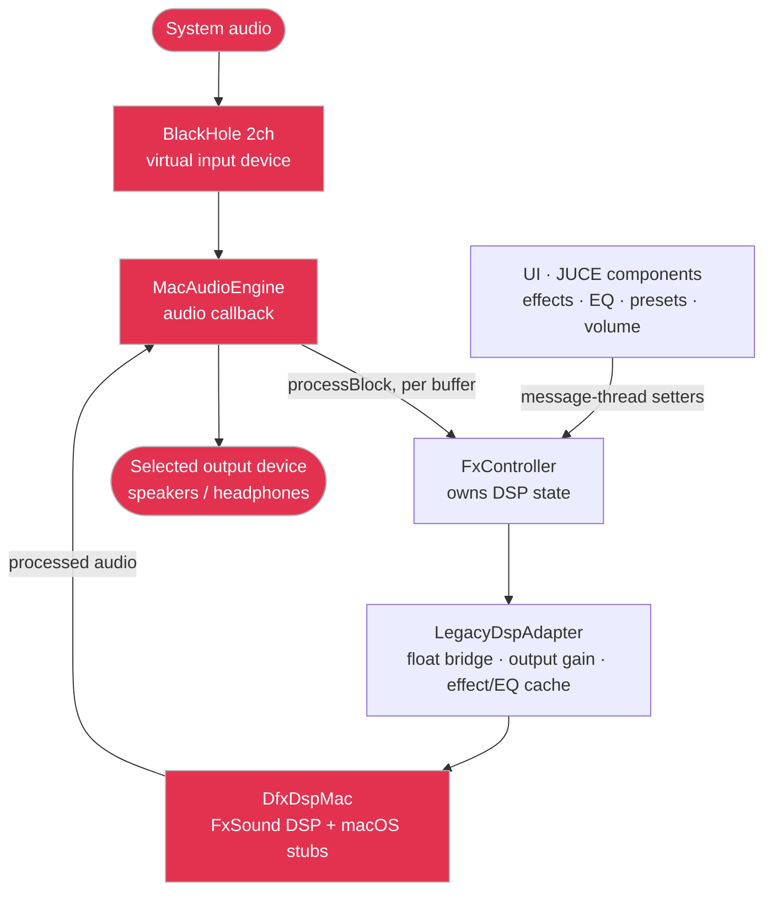

# FxSound for macOS

A macOS port of [FxSound](https://www.fxsound.com) — a real-time audio enhancer that adds a clean
high-fidelity processing stage to your system audio, plus tunable effects and a graphic equalizer.

This repository is a **macOS-focused fork**. The macOS app lives under [`FxSoundMac/`](FxSoundMac) and is
a standalone CMake project. The original Windows application (Visual Studio / JUCE 6) is kept alongside it
and is documented under [Original Windows app](#original-windows-app-upstream) below.

> macOS has no system-wide audio driver hook like the Windows version. Instead, the port captures system
> audio through the **BlackHole** virtual audio device, runs it through the FxSound DSP, and plays the
> processed result out to the real output device you choose.

```
System audio ──▶ BlackHole 2ch ──▶ FxSound (DSP) ──▶ your speakers / headphones
```

## Features

- Clean passthrough plus five effects: **Clarity, Ambience, Surround Sound, Dynamic Boost, Bass Boost**
- 10-band **graphic EQ** with a live response curve (Alt-drag to solo a band, right-click to reset)
- **Presets** — factory presets plus **save / import / delete** of your own (effects *and* EQ)
- Output **volume** control, **power** toggle, and a configurable **close-button** behavior
- Dark UI matching the Windows app; universal binary (Apple Silicon + Intel)

## Requirements

- macOS 13 (Ventura) or newer
- [BlackHole 2ch](https://github.com/ExistentialAudio/BlackHole): `brew install --cask blackhole-2ch`

To build from source you also need:

- Xcode (latest stable) with command-line tools
- CMake ≥ 3.22 (`brew install cmake`)
- Internet access for the first configure (JUCE 7.0.12 is fetched via CMake `FetchContent`)

## Install — from clone to running

A complete walkthrough assuming a fresh Mac with nothing installed yet.

### 1. Install the build tools and BlackHole

Install [Homebrew](https://brew.sh) if you don't have it, then:

```bash
# Xcode command-line tools (compiler + git)
xcode-select --install

# CMake and the BlackHole 2ch virtual audio device
brew install cmake
brew install --cask blackhole-2ch
```

You also need a full **Xcode** install (from the App Store), not just the command-line tools — the build
uses the Xcode generator. Launch Xcode once to accept its license, or run `sudo xcodebuild -license accept`.

### 2. Clone the repository

```bash
git clone https://github.com/okku007/fxsound-mac.git
cd fxsound-mac/FxSoundMac
```

### 3. Configure the project (first time only)

```bash
cmake -B build -G Xcode -DCMAKE_OSX_ARCHITECTURES="arm64;x86_64"
```

This downloads JUCE 7.0.12 (via CMake `FetchContent`) and generates an Xcode project under `build/`.
The first run needs internet and takes a few minutes; later builds skip the download.

### 4. Build the app

```bash
# Debug (fastest to build, for trying it out)
cmake --build build --config Debug --target FxSoundMac

# …or Release (optimized universal binary, ad-hoc signed for local use)
cmake --build build --config Release --target FxSoundMac
```

The built app lands at:

- Debug: `build/FxSoundMac_artefacts/Debug/FxSound.app`
- Release: `build/FxSoundMac_artefacts/Release/FxSound.app`

### 5. Launch it

```bash
open build/FxSoundMac_artefacts/Debug/FxSound.app
```

To "install" it like a normal app, drag `FxSound.app` into `/Applications`. On first launch macOS asks for
**microphone access** — allow it; that permission is what lets the app capture audio from BlackHole.

### 6. Route your system audio through BlackHole

1. Open **System Settings ▸ Sound ▸ Output** and select **BlackHole 2ch**. This sends all system audio
   into the app instead of straight to your speakers.
2. In FxSound, pick your real speakers/headphones in the **Output** dropdown.
3. Click **Start** next to *Routing Through BlackHole*.

You should now hear your audio — processed — coming out of the output device you chose. Play something and
adjust effects, EQ, presets, and volume live.

### 7. When you're done

Click **Stop**, then switch **System Settings ▸ Sound ▸ Output** back to your normal speakers/headphones.

> Tips: the status bar at the bottom of the window guides you through anything missing (BlackHole not
> installed, no output selected, …). The **gear** button chooses whether the window's close button quits
> the app or just hides it (reopen it from the Dock icon).

## Tests & validation

```bash
cd FxSoundMac
cmake --build build --config Debug --target FxSoundMacTests
./build/FxSoundMacTests_artefacts/Debug/FxSoundMacTests

# Verify NSMicrophoneUsageDescription is present in the bundle
bash Tests/check_info_plist.sh build/FxSoundMac_artefacts/Debug/FxSound.app
```

For end-to-end audio checks (BlackHole setup, DSP controls, device switching, recovery), see
[`FxSoundMac/MANUAL_VALIDATION.md`](FxSoundMac/MANUAL_VALIDATION.md).

## Architecture (macOS)



`MacAudioEngine` opens a single `AudioDeviceManager` route: BlackHole (input) → DSP → selected output
device. The UI sets DSP state on `FxController` from the message thread, while the audio callback runs
`processBlock` on the audio thread (no locks or allocation in that path). The Windows-only sources under
`dsp/` and `audiopassthru/` are treated as read-mostly legacy and compiled into the `DfxDspMac` static
library with thin macOS shims.

---

## Original Windows app (upstream)

The canonical FxSound project (Windows) is at **https://github.com/fxsound2/fxsound-app**.

* Website: https://www.fxsound.com
* Installer: https://download.fxsound.com/fxsoundlatest
* Issue tracker: https://github.com/fxsound2/fxsound-app/issues
* Forum: https://forum.fxsound.com
* [Donate to FxSound](https://www.paypal.com/donate/?hosted_button_id=JVNQGYXCQ2GPG)

### Windows build prerequisites

* Install the [latest version of FxSound](https://download.fxsound.com/fxsoundlatest) (provides the
  FxSound Audio Enhancer virtual audio driver the app needs at runtime)
* [Visual Studio 2022](https://visualstudio.microsoft.com/vs) and the
  [Windows SDK](https://developer.microsoft.com/en-us/windows/downloads/windows-sdk)
* [JUCE 6.1.6](https://github.com/juce-framework/JUCE/releases/tag/6.1.6) for x64/x86, and the
  [latest JUCE](https://api.juce.com/api/v1/download/juce/latest/windows) for ARM64

### Build from Visual Studio

Open `fxsound/Project/FxSound.sln`, then build/run the desired configuration and platform.

The app has three components: the JUCE GUI application, the **audiopassthru** module (audio-device
interaction), and the **DfxDsp** module (audio DSP). After exporting the solution from Projucer you must:

1. Add the existing `audiopassthru/audiopassthru.vcxproj` and `dsp/DfxDsp.vcxproj` projects to the solution.
2. Add references to `audiopassthru` and `DfxDsp` from the `FxSound_App` project.
3. To use presets when running from Visual Studio, set the `FxSound_App` working directory to
   `$(SolutionDir)..\..\bin\$(PlatformTarget)`.

## Contributing

Contributions are welcome — see [CONTRIBUTING.md](./CONTRIBUTING.md).

## Acknowledgements

- This project uses the [JUCE](https://juce.com) framework, licensed under
  [AGPL v3.0](https://github.com/juce-framework/JUCE/blob/master/LICENSE.md).
- macOS audio routing relies on [BlackHole](https://github.com/ExistentialAudio/BlackHole) by Existential Audio.
- Thanks to [Theremino](https://www.theremino.com) for major feature enhancements in upstream FxSound,
  and to Advanced Installer for the Windows installer tooling.

## License

[AGPL v3.0](./LICENSE)
